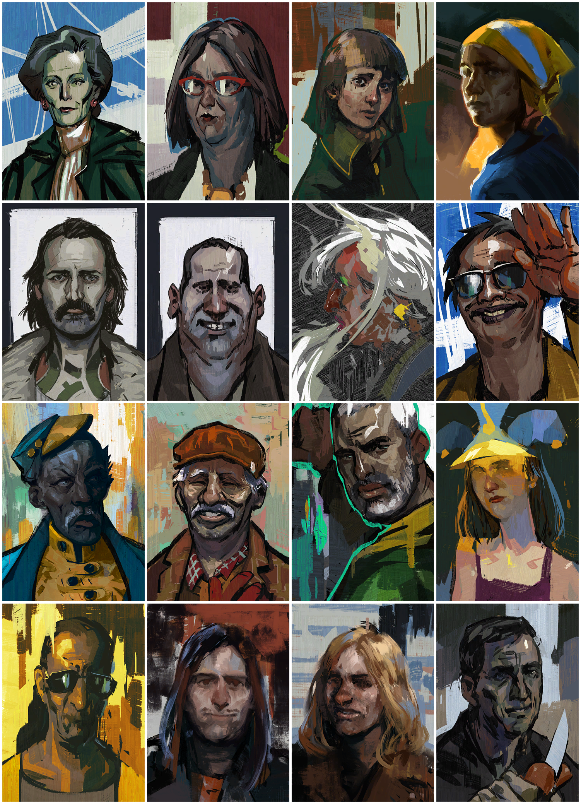
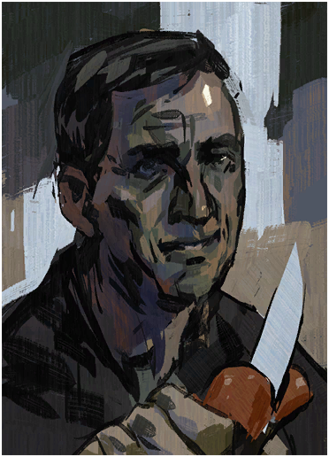
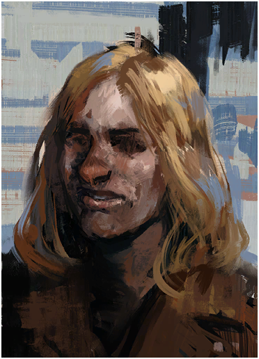
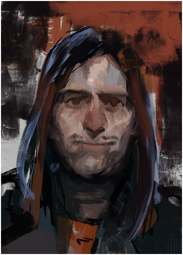

# Extract rectangular pictures from a picture

This Python script takes a picture, finds rectangular objects within it (possibly photos), and saves each rectangle as a separate image file.

## Running
0. Have python installed; tested on 3.10 and 3.11
1. Open cmd in the folder where the script is
2. pip install opencv-python
3. python run extract_pictures.py
4. follow instructions

## Troubleshooting

I tried handling different versions of OpenCV library. If you get an OpenCV Error just make sure OpenCV's version is either 2.x or 4.x

## Example input

## Example output

... and so on ...

